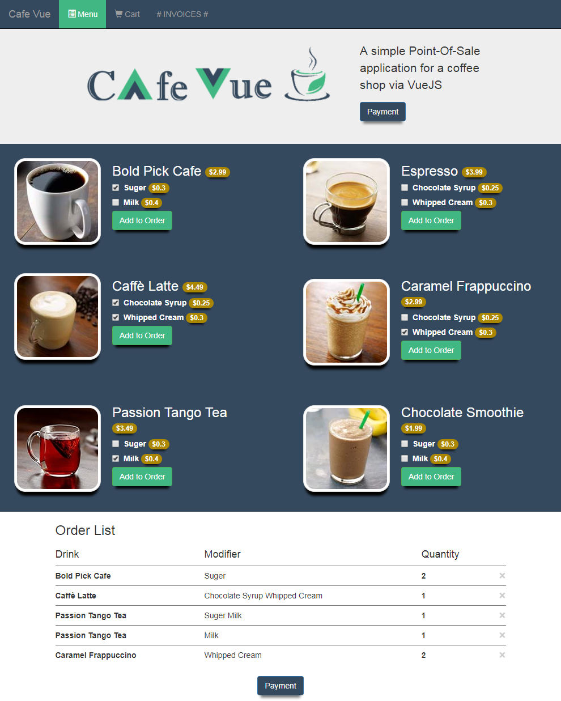
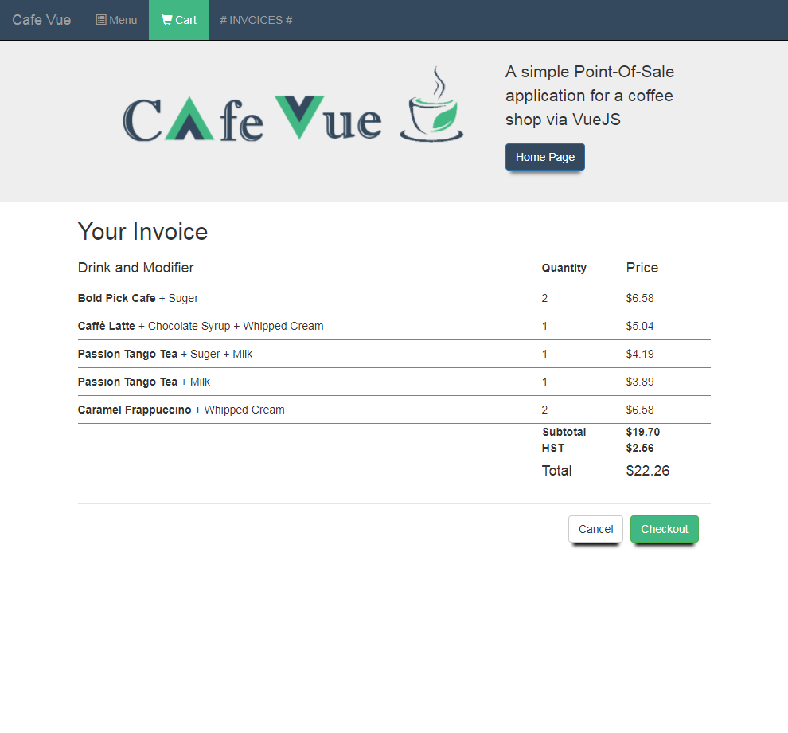

# CafeVue

> A simple POS application for a coffee shop like Starbucks. There is a page
 for the selection of base drinks and their associated modifiers. A page for the
confirmation of purchase is showing the cost based on drink type and chosen
modifiers.

## Demo

## technologies
* HTML5, CSS, JS, JQuery, [Bootstrap](http://getbootstrap.com/): frone-end
* [VueJs framework](https://vuejs.org/)
* Webpack : automation

# How to run application on the local computer :

Open bash or cmd and direct to CafeVue folder then

1)  install dependencies
> npm install

2)  run json server
> json-server .\json-server-api\db.json

3)  serve with hot reload at localhost:8080
> npm run dev

## License

[MIT License].
